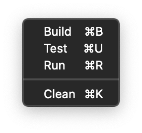

# Swift Package Manager.tmbundle

## TextMate support for building with Swift Package Manager

This bundle provides plug'n'play access to `swift build` et al. from a set of simple menu commands.

## Install

Clone or otherwise download this repository, rename the folder to `Swift Package Manager.tmbundle`, and open the resulting package in TextMate.

e.g., from the command line:

    git clone https://github.com/ThatsJustCheesy/swift-package-manager.tmbundle 'Swift Package Manager.tmbundle'
    open 'Swift Package Manager.tmbundle'
    # TextMate prompts to install the bundle. Select Install.
    rm -rf 'Swift Package Manager.tmbundle'

## Use

Execute any of Build, Test, Run or Clean in a project folder containing a `Package.swift` file.
